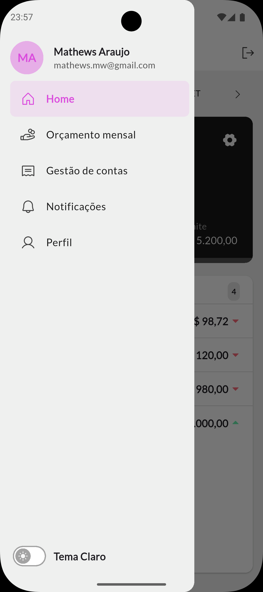

# **Nummo - Personal Finance Management**

**Nummo** is a mobile application developed with **Flutter** to help users manage their personal finances in a practical, visual, and organized way. With Nummo, you can record income and expenses, plan monthly budgets, track bills, and receive **automatic reminders** via local notifications. The app also works in **offline-first** mode, so you can use it without an internet connection.

<div align="center">
    
    
    
    
    
    
</div>

----------

## 📱 **Overview**

Nummo’s goal is to provide an intuitive tool for financial control, enabling users to:

-   Have a clear view of their expenses and income.
    
-   Organize bills and payments (recurring or one-time).
    
-   Receive scheduled payment reminders.
    
-   Access and update their data even without an internet connection.
    

----------

## ✨ **Key Features**

-   **User profile creation** and customization.
    
-   **Monthly budget planning** with visual tracking.
    
-   **Income and expense tracking**.
    
-   **Bill management** with recurring or one-time payments.
    
-   **Local scheduled notifications** for reminders.
    
-   **Dark mode and light mode** with Material 3 support.
    
-   **Offline-first operation** with local data storage.
    

----------

## ⚙️ **How It Works**

1.  The user registers bills, incomes, and expenses.
    
2.  Each bill can be set as **recurring** or **one-time**.
    
3.  Notifications are scheduled using **flutter_local_notifications**.
    
4.  All data is stored locally with **Drift**.
    
5.  The interface adapts responsively to light/dark themes.
    

----------

## 🛠 **Technologies & Tools**

-   **Framework:** Flutter (Material 3, Dart)
    
-   **State Management:** Provider
    
-   **Local Database:** Drift (SQLite)
    
-   **Local Notifications:** flutter_local_notifications
    
-   **Debounce & Filters:** for optimized listing and search
    
-   **Offline-first:** persistent local storage
    
-   **Theming:** Custom light/dark mode using `ColorScheme`
    
-   **Design:** Google Fonts (Lato), custom color scheme
    

----------

## 📂 **Project Structure**

```bash
lib/
 ├── data/        # Data layer (Drift, repositories, models)
 ├── domain/      # Business rules and entities
 ├── ui/          # UI components and screens
 ├── providers/   # State providers
 ├── services/    # Services like NotificationService
 ├── theme/       # Color and theme definitions
 └── main.dart    # Application entry point
```
----------

## 🚀 **Getting Started**

1.  Clone this repository:
    
    `git clone https://github.com/yourusername/nummo.git cd nummo` 
    
2.  Install dependencies:
    
    `flutter pub get` 
    
3.  Run on a device or emulator:
    
    `flutter run` 
    

----------

## 📌 **Next Steps**

-   Cloud API integration for data sync.
    
-   Detailed dashboards and charts.
    
-   Data export/import features.
    
-   Automatic backups.
    

----------

## 📄 **License**

This project is licensed under the MIT License - see the LICENSE file for details.